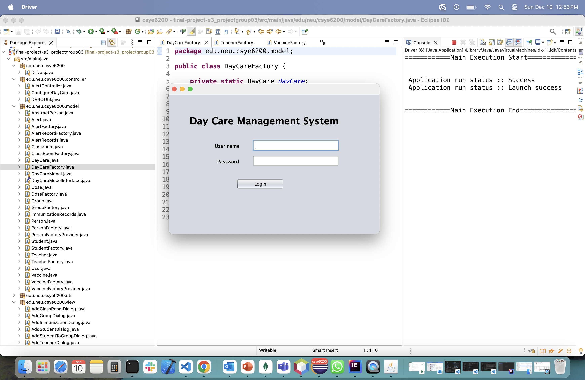
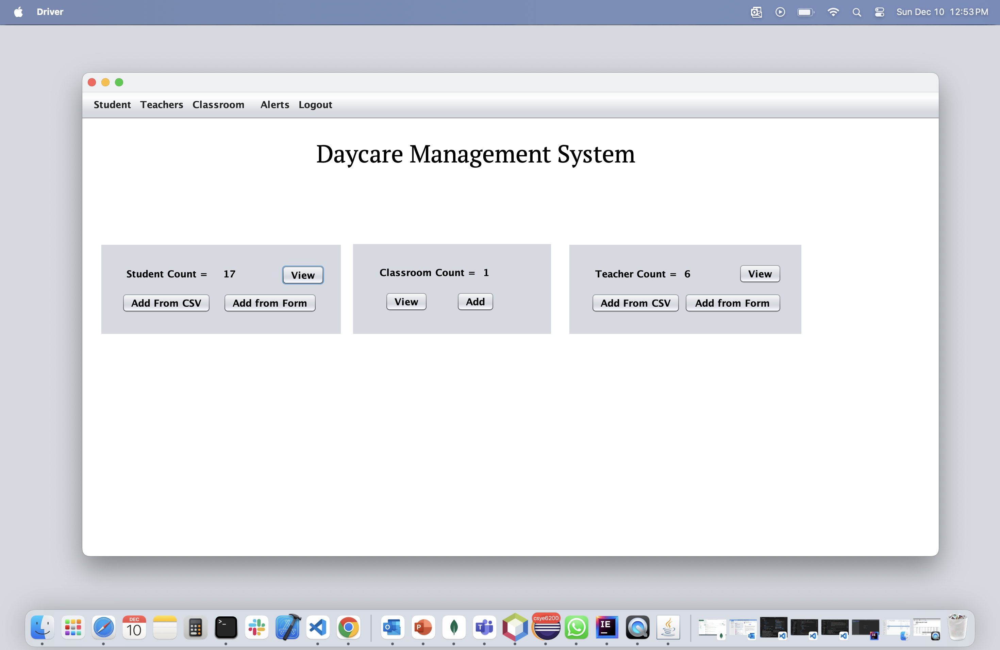
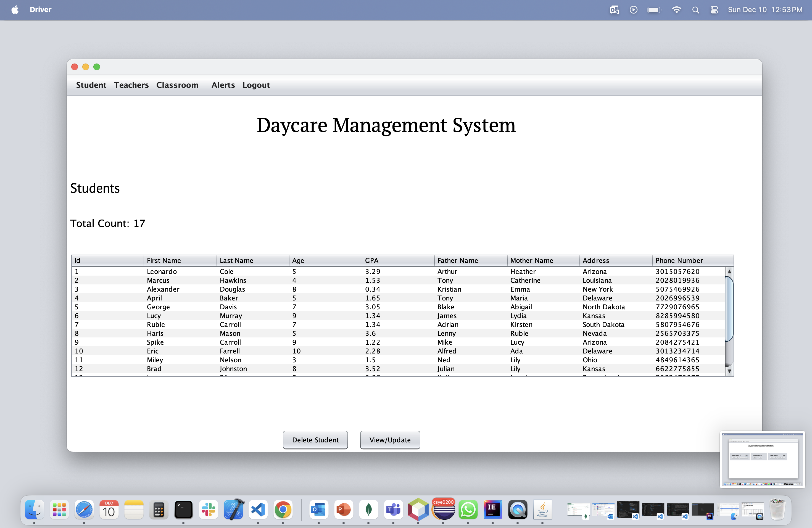
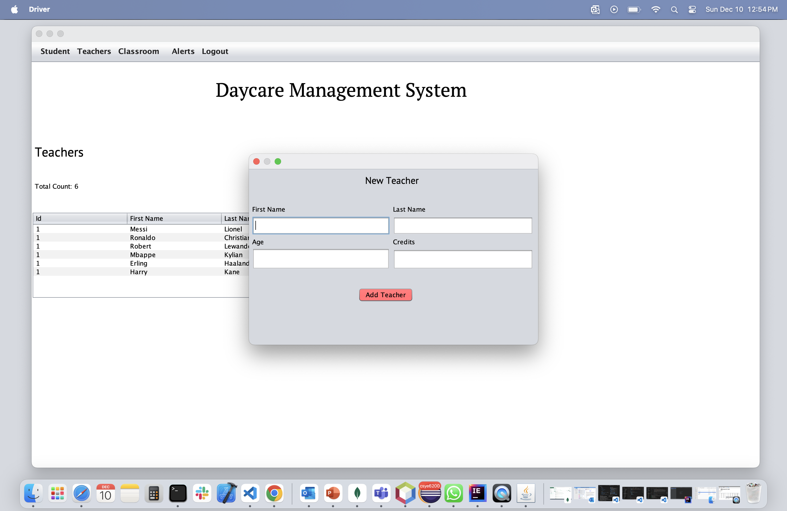
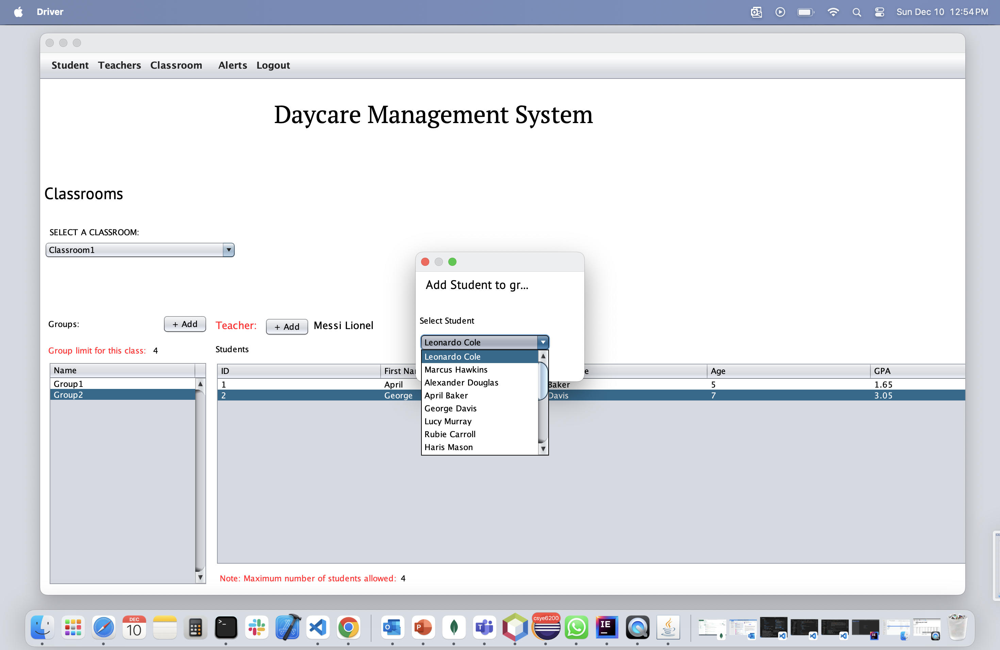
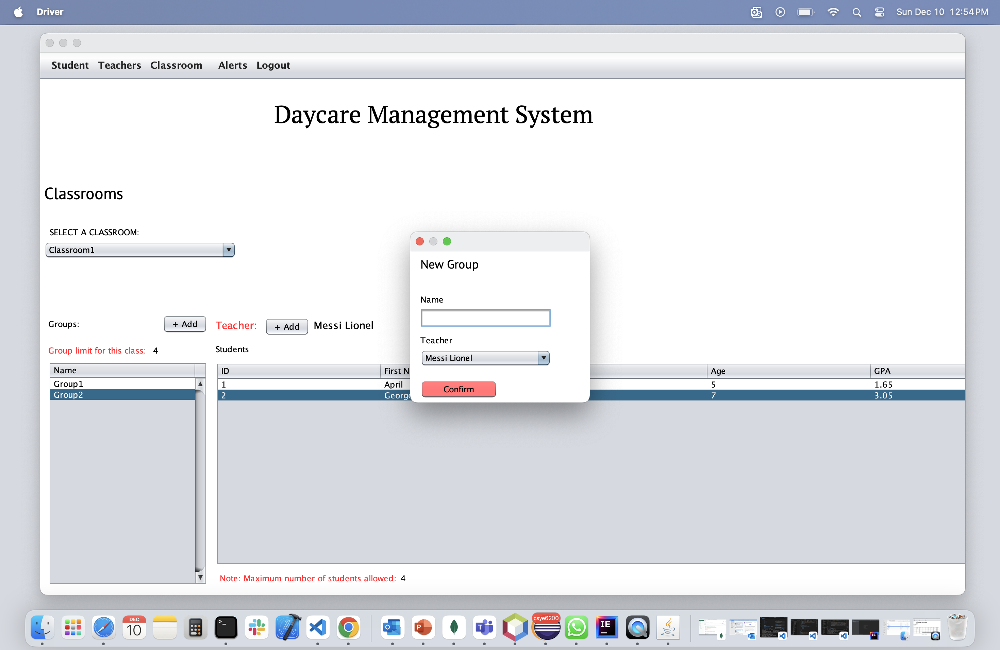
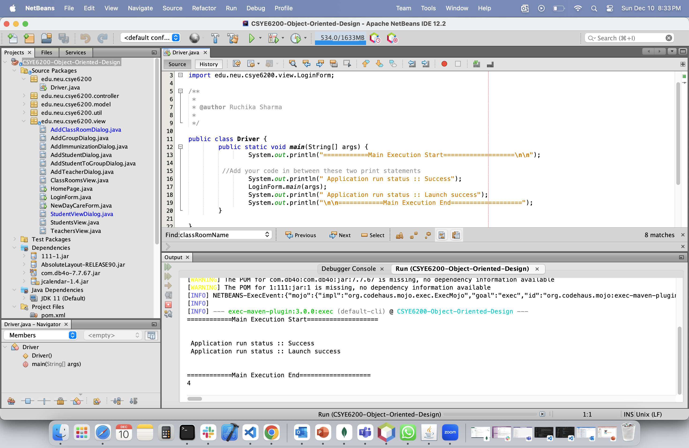

# Welcome to the course CSYE6200 - Object Oriented Design
> Northeastern University, College of Engineering

### This is Final Project - DayCare Management System

Note: If you are using Eclipse, please have git CLI installed on your system or GitHub Desktop to commit the code in this repository. And the run the `Driver.java`

### SetUp Instructions
1. Please clone the repository on your local system
2. For Eclipse Import the project as Existing Maven Project, For IntelliJ you can directlty open it using 'Get from VCS'.
3. For Netbeans support import maven as maven project and build the project.
4. Run on either netbeans or eclipse.

Author:
- Amar Nagargoje
- Tanmay Gokhale
- Madhu Sai Kalyan Kaluri
- Rutvik Bangalore Ravi
- Neha Balaji
- Ankush Maheshwari
- Mridula Prabhakar
- Khushank Mistry
- Mihir Dadwal

### Output

